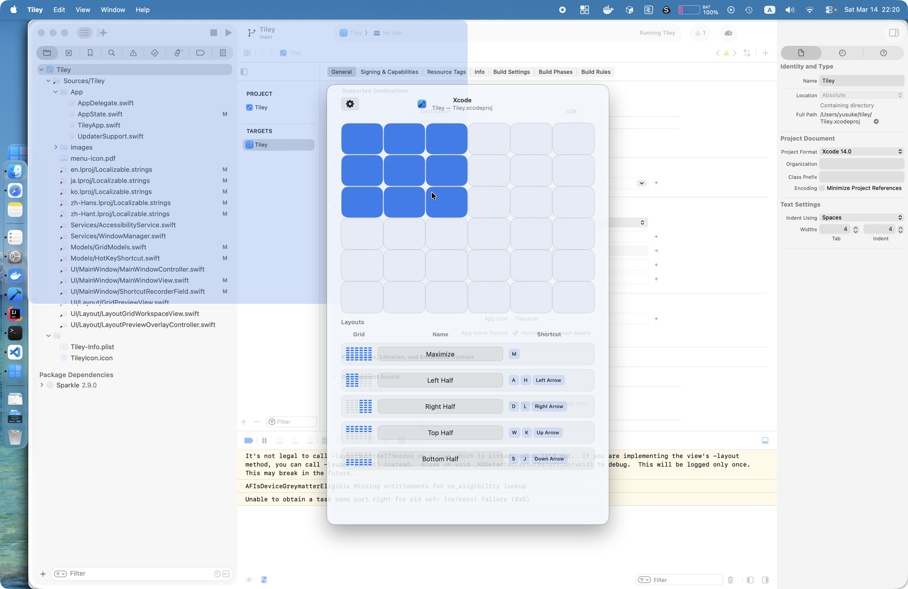

  

<h1 align="center">Tiley</h1>

  A simple macOS utility to arrange your windows. Drag a grid, place a window.

  <a href="https://github.com/yusuke/tiley/releases/latest"><strong>Download</strong></a> &nbsp;·&nbsp;
  <a href="https://yusuke.github.io/tiley/">Website</a> &nbsp;·&nbsp;
  <a href="https://github.com/sponsors/yusuke">Sponsor</a>

  

## Features

- **Grid Overlay** — A customizable grid appears over your screen. Drag to select the region where you want to place a window.
- **Global Shortcuts** — Trigger the grid or apply layout presets instantly with customizable keyboard shortcuts.
- **Layout Presets** — Save frequently used layouts — Left Half, Right Half, Maximize, and more — and apply them in one step.
- **Native on Apple Silicon** — Built natively for Apple Silicon with Swift and AppKit. Fast, efficient, and right at home on your Mac.
- **Customizable Grid** — Adjust rows, columns, and gap size to match your workflow and display setup.
- **Auto Updates** — Built-in update checking via Sparkle keeps you on the latest version automatically.

## How It Works

1. **Activate** — Press the global shortcut or click the menu bar icon to show the layout grid.
2. **Select** — Drag across the grid cells to define the region where you want your window placed.
3. **Done** — The frontmost window is moved and resized to fit your selection instantly.

## Default Shortcut

Open the grid overlay with one keystroke:

> **Shift + Command + Space**

## FAQ

**What macOS versions are supported?**
Tiley requires macOS 14 (Sonoma) or later.

**Why does Tiley need Accessibility permissions?**
macOS requires Accessibility access to move and resize windows belonging to other applications. Tiley uses the Accessibility API solely for window management — no data is collected.

**Can I change the grid size?**
Yes. Open Settings from the menu bar to adjust the number of rows, columns, and the gap between cells.

**Can I assign shortcuts to specific layouts?**
Yes. Each layout preset (Maximize, Left Half, etc.) can have its own global shortcut assigned in Settings.

**Is Tiley free?**
Yes, Tiley is free and open source. The source code is available on GitHub.

## Contributing

See [CONTRIBUTING.md](./CONTRIBUTING.md) for build instructions, project layout, and development guidelines.

## License

Licensed under the Apache License, Version 2.0. See [LICENSE](./LICENSE).
